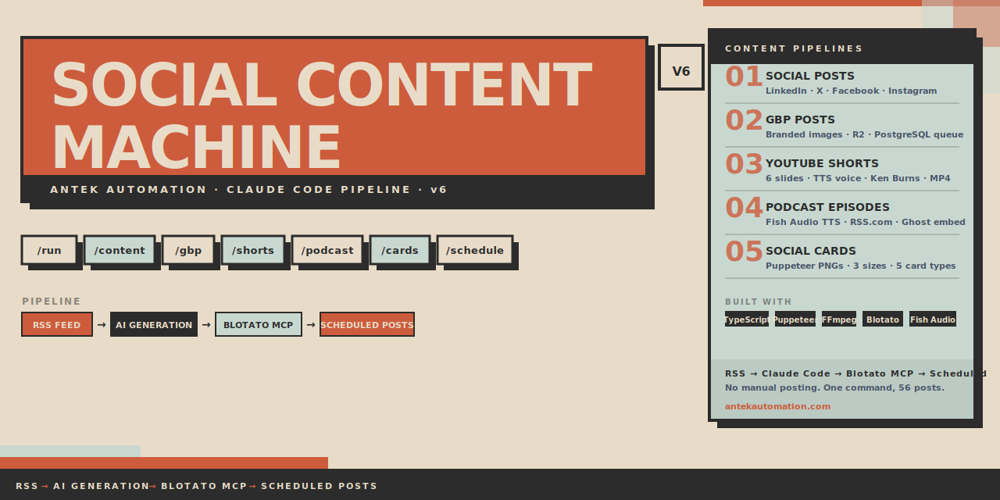

<div align="center">
  
</div>

<br/>

<div align="center">

**Social Content Machine v6** — A Claude Code pipeline that turns blog RSS into scheduled social posts, Google Business Profile updates, YouTube Shorts, podcast episodes, and branded image cards. Fully automated from content generation to scheduling via Blotato MCP.

[](https://www.typescriptlang.org/)
[](https://nodejs.org/)
[](https://claude.ai/code)
[](https://ffmpeg.org/)

</div>

---

## What It Does

One command reads your blog RSS feed and produces:

| Pipeline | Output | Platforms |
|----------|--------|-----------|
| **Social Posts** | 14 days of native posts per platform | LinkedIn, X/Twitter, Facebook, Instagram |
| **GBP Posts** | Branded image posts with R2 upload | Google Business Profile |
| **YouTube Shorts** | 6-slide MP4 with TTS voiceover | YouTube Shorts, Instagram Reels, Facebook Reels |
| **Podcast** | Full episode MP3 with distribution | RSS.com → Apple, Spotify, Google, Amazon + Ghost embed |
| **Social Cards** | Branded PNG cards in 3 sizes | LinkedIn, Instagram, Facebook, X |

All content is written in Andy's voice (founder, Antek Automation), UK English, with Andy's persona baked in — not generic AI copy.

---

## Prerequisites

```bash
# Required system tools
brew install ffmpeg          # Shorts + Podcast audio/video processing (includes ffprobe)

# Required: Claude Code CLI (this runs inside Claude Code, not standalone)
# Install at: https://claude.ai/code
```

**Node.js 22+** — Puppeteer requires a recent Node version.

**Claude Code** — All pipelines run as Claude Code slash commands. The AI does the content generation and MCP calls interactively. This is not a standalone CLI.

---

## Installation

```bash
git clone https://github.com/Nipstar/content-machine.git
cd content-machine/files
npm install
cp .env.example .env
# Fill in .env — see Configuration section below
```

---

## Configuration

All variables go in `files/.env`. Copy from `files/.env.example`.

### Required for all pipelines

| Variable | Where to get it |
|----------|----------------|
| `BLOTATO_API_KEY` | [app.blotato.com](https://app.blotato.com) → Settings → API |

### Required for social post scheduling (Blotato)

These are your Blotato connected account IDs (numeric). Find them at app.blotato.com → Connected Accounts.

```
LINKEDIN_ACCOUNT_ID=
TWITTER_ACCOUNT_ID=
FACEBOOK_ACCOUNT_ID=
INSTAGRAM_ACCOUNT_ID=
```

### Required for GBP, Shorts, and Podcast (database + storage)

```
DATABASE_URL=postgresql://...     # PostgreSQL connection string
DATABASE_SSL=true                 # Set "false" to disable SSL

R2_ACCOUNT_ID=                    # Cloudflare account ID
R2_API_TOKEN=                     # Cloudflare R2 API token
R2_BUCKET_NAME=gbp-images         # R2 bucket name
R2_PUBLIC_URL=                    # e.g. https://gbp-images.yourdomain.com
```

### Required for Shorts and Podcast (TTS)

```
FISH_AUDIO_API_KEY=               # fish.audio → API Keys
FISH_AUDIO_VOICE_ID=              # Optional — omit to use Fish Audio default voice
```

Voice used for Antek: `f449632487b740fdab7e44dc4a850948`

### Required for Podcast distribution

```
GHOST_ADMIN_API_URL=              # https://your-ghost-blog.com
GHOST_ADMIN_API_KEY=              # Ghost Admin → Integrations → Custom Integration → {id}:{secret}

RSS_COM_API_KEY=                  # RSS.com dashboard → profile → API Access (Network plan)
RSS_COM_PODCAST_ID=               # Your show ID from RSS.com
```

**One-time RSS.com setup:** Create your podcast show on the RSS.com dashboard first. Set show artwork (1400×1400px). Copy the podcast ID and API key to `.env`.

---

## Usage — Slash Commands

Open Claude Code in the project root. All pipelines run as slash commands.

### `/run` — Full pipeline (start here)

```
/run
```

Fetches the blog RSS, generates 14 days of content for all platforms, assigns Blotato templates, opens a preview, then creates visuals and schedules all posts via Blotato MCP.

Steps: RSS fetch → AI content generation → `content.json` → build → HTML preview → Blotato visuals → scheduled posts

---

### `/content` — Content generation only

```
/content
```

Fetches RSS and generates `content.json` with UK English copy for all platforms. Does **not** schedule anything. Use when you want to review and edit content before scheduling.

---

### `/schedule` — Schedule from existing content.json

```
/schedule
```

Skips content generation. Reads the existing `content.json`, creates Blotato visuals, and schedules all posts. Use after `/content` once you've reviewed the copy.

---

### `/gbp` — Google Business Profile posts

```
/gbp
/gbp --count 14
/gbp --frequency daily
/gbp --start 2026-05-01
```

Generates GBP-optimised posts from blog RSS. Creates branded 1200×900 PNG images (4 template variants: stat, tip, quote, question) via Sharp, uploads to Cloudflare R2, and queues posts in PostgreSQL. **Posting to GBP is handled by n8n WF7 — this pipeline only queues the content.**

GBP post rules:
- Max 1,500 characters
- No phone numbers in post text (Google rejects these)
- No em-dashes
- Ends with a CTA mapped to a button type: `LEARN_MORE`, `CALL`, `BOOK`, `ORDER`, `SIGN_UP`

---

### `/shorts` — YouTube Shorts / Reels

```
/shorts
/shorts --url https://your-blog.com/post-slug/
/shorts --platforms youtube,instagram,facebook
/shorts --platforms all
/shorts --platforms reels          # instagram + facebook only
/shorts --no-voice                 # silent mode (5s per slide)
```

Generates a ~40-50 second short-form video from a blog post.

**What it produces:**
- 6 neo-brutalist slides (1080×1920) rendered via Puppeteer
- Per-slide voiceover audio via Fish Audio TTS (S2 Pro)
- FFmpeg stitches PNGs + audio into H.264 MP4 with Ken Burns zoom + crossfades
- Uploads to Cloudflare R2
- Schedules the **same MP4** to each target platform via Blotato MCP with platform-specific metadata

**Slide structure:**
1. Hook — bold question or stat
2. Tip 1 — actionable (max 12 words on screen)
3. Tip 2
4. Tip 3
5. Summary — one-line takeaway
6. CTA — hardcoded Antek branding

**Critical FFmpeg rule:** PNG inputs must have NO `-loop`, `-r`, or `-t` flags. A PNG is a single frame — zoompan's `d` parameter controls duration directly. Adding input options multiplies it into multi-minute videos.

---

### `/podcast` — Podcast episodes

```
/podcast
/podcast --url https://your-blog.com/post-slug/
/podcast --no-music
/podcast --no-upload           # local testing only
/podcast --no-ghost            # skip Ghost embed
/podcast --no-youtube          # skip YouTube video
/podcast --schedule "2026-05-01T10:00:00Z"
/podcast --audio-only          # produce MP3 only
```

Generates a 6-7 minute episode from a blog post in Andy's voice.

**Episode structure:**
1. Intro (20-30s) — "Hey, it's Andy from Antek Automation..."
2. Context (40-60s) — Vivid scenario with real data
3. Tips 1-3 (90s) — Practical, with Antek breadcrumbs
4. Blog CTA (hardcoded mid-roll)
5. Tips 4-5 (60s)
6. Mid CTA (hardcoded mid-roll)
7. Tips 6-7 (optional)
8. Recap (20-30s)
9. Outro (hardcoded)

**Distribution pipeline:**
- MP3 → Cloudflare R2 (permanent storage)
- MP3 → RSS.com → Apple Podcasts, Spotify, Google Podcasts, Amazon Music
- Audio player embedded in Ghost blog post
- Branded 1920×1080 video rendered for YouTube (NOT auto-uploaded — queued in PostgreSQL)

---

### `/cards` — Social image cards

```
/cards
/cards --url https://your-blog.com/post-slug/
/cards --types stat,quote,tip,listicle
/cards --sizes landscape,square,portrait
/cards --count 4
```

Generates branded PNG cards from blog content. No Blotato dependency — fully local.

**Card types:**
| Type | Content |
|------|---------|
| `stat` | Large number + supporting context |
| `quote` | Pull quote (max 20 words) + "— Andy Norman, Antek Automation" |
| `tip` | Numbered tip (max 15 words) — designed as carousel series |
| `listicle` | Title + 3-4 bullet points |
| `cta` | Hardcoded Antek brand closer |

**Output sizes:**
| Size | Dimensions | Best for |
|------|-----------|---------|
| `landscape` | 1200×628px | LinkedIn feed |
| `square` | 1080×1080px | Instagram, Facebook, X |
| `portrait` | 1080×1350px | Instagram (more real estate) |

Cards saved to `files/output/cards/[slug]_[type]_[size].png`. Upload to R2 and use URLs with `/schedule` instead of Blotato-generated visuals for fully on-brand images.

---

## Architecture

```
files/
├── index.ts              # CLI entry — 3-phase pipeline (content → templates → preview)
├── generate-content.ts   # Reads content.json, builds scheduling slots
├── template-mapping.ts   # ContentCategory → Blotato template ID
├── types.ts              # Core interfaces: ContentIdea, Pillar, Platform, ContentCategory
├── preview.ts            # HTML preview with platform tabs + char count colour coding
├── load-briefs.ts        # PostgreSQL: load approved briefs (--from-db mode)
├── generate-gbp.ts       # GBP orchestrator
├── gbp-*.ts              # GBP: image gen (Sharp), R2 upload, DB queue, CLI
├── generate-shorts.ts    # Shorts orchestrator + platform metadata
├── shorts-*.ts           # Shorts: TTS, Puppeteer frames, FFmpeg, DB, CLI
├── generate-podcast.ts   # Podcast orchestrator + hardcoded CTAs/outro
├── podcast-*.ts          # Podcast: TTS, upload (R2+RSS.com), Ghost, YouTube, DB
├── generate-cards.ts     # Cards: content extraction + validation
└── cards-*.ts            # Cards: Puppeteer renderer (5 types × 3 sizes)
```

**Three content sources:**
1. **RSS** (default) — fetches `https://blog.antekautomation.com/rss/` and repurposes articles
2. **Database** (`--from-db`) — pulls approved briefs from PostgreSQL `articles` table
3. **Pillar-based** — Claude generates fresh ideas from content pillars (opinion posts, polls)

**Blotato MCP workflow (social posts):**
1. `npm run generate` — CLI assigns template IDs + scheduling times to `content.json`
2. Claude Code calls `blotato_create_visual` per idea (polls `blotato_get_visual_status`)
3. Claude Code calls `blotato_create_post` per idea × platform with media URLs + scheduled time

---

## Database Tables

All tables auto-create on first use.

| Table | Purpose | Status flow |
|-------|---------|-------------|
| `articles` | Content briefs (--from-db) | `discovered → approved → social_queued → published` |
| `gbp_post_queue` | GBP posts | `queued → posted \| failed` |
| `shorts_queue` | Shorts (one row per platform) | `queued → scheduled \| failed` |
| `podcast_queue` | Podcast episodes + distribution tracking | `queued → uploaded → distributed \| failed` |

---

## Content Rules

All content writes as **Andy Norman** — founder of Antek Automation, Andover, Hampshire, UK. 30+ years in managed print services. UK AI automation agency.

**Persona:** Trusted local expert. Direct. Practical. No polish, no pitch. First person always.

**UK English non-negotiables:**
colour, organise, whilst, realise, licence, programme, maths, practise, enquiry

**Banned:**
- Em-dashes (renders poorly on LinkedIn/mobile)
- "game-changing", "revolutionary", "leverage", "synergy", "empower", "unleash"
- "In today's fast-paced world", "I'm excited to share", "Let that sink in."
- American spellings, "utilize" (use "use")
- "DM me" CTAs — use blog URLs instead

**Platform character limits:**

| Platform | Limit | Links |
|----------|-------|-------|
| LinkedIn | 1,300 chars | Body: NO links (kills reach) — use `first_comment` |
| X/Twitter | 280 chars hard | Fine in body |
| Facebook | 40-100 words | Fine in body |
| Instagram | 150-300 visible | N/A — hashtags in `first_comment` |

---

## Brand Design System

Neo-brutalist across all visual outputs (GBP images, Shorts frames, Cards):

- **Coral/rust** `#CD5C3C` — primary
- **Cream** `#E8DCC8` — background
- **Sage green** `#C8D8D0` — secondary
- **Charcoal** `#2C2C2C` — text / elements

No rounded corners. No gradients. Thick borders (3-4px). Offset shadows via overlapping rectangles. Inter 900-weight headings. Asymmetric layouts.

---

## Integration Context

This project sits in the middle of a larger n8n automation pipeline:

```
WF1/WF2: RSS discovery → brief generation → approval (upstream)
    ↓
This project: approved briefs/RSS → social/GBP/Shorts/Podcast/Cards → Blotato + R2 + PostgreSQL
    ↓
WF3: full blog post → Ghost CMS (parallel)
    ↓
n8n WF7: GBP posting from gbp_post_queue (downstream)
```

YouTube Shorts and Podcast videos are queued to PostgreSQL — upload to YouTube is handled separately (manually or via n8n).

---

## Built By

[Antek Automation](https://antekautomation.com) — AI automation agency for UK service businesses.
